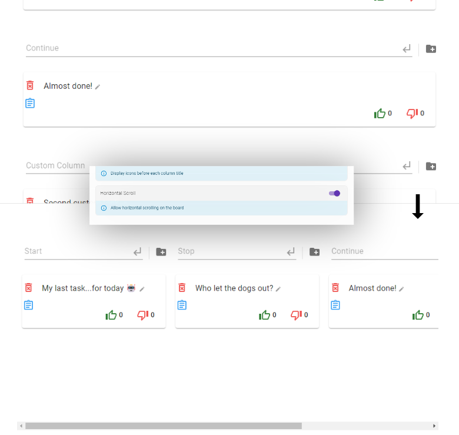
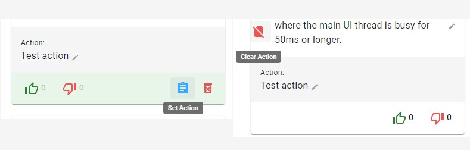
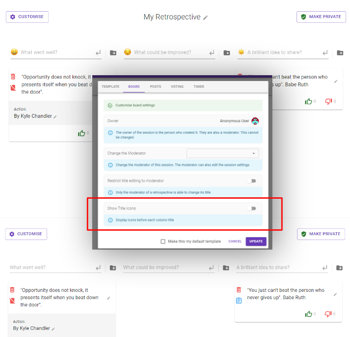
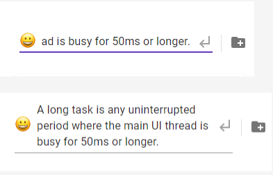

### Links

- [Web](https://www.retrospected.com/)
- [Code](https://github.com/antoinejaussoin/retro-board)

---

### Good

- **Self-Hosting**: The application can be self-hosted, providing flexibility and control over the deployment environment.
- **Multilingual Interface**: Supports multiple languages, making it accessible to a broader audience.
- **Local Content Encryption**: Ensures that content is encrypted locally, enhancing security and privacy.
- **Kubernetes Compatibility**: Ready to run in a Kubernetes cluster, which is great for scalability and orchestration.
- **AI Agile Coach**: Integration with ChatGPT for an AI agile coach, adding value to the retrospective process.
- **Docker Support**: The application can be easily containerized using Docker, simplifying deployment and management.
- **Comprehensive Documentation**: The documentation is detailed and provides clear instructions for setup and usage.

---

### Can improve

- **Drag and Drop Library**: The application uses `react-beautiful-dnd`, which will be deprecated on April 30, 2025. A new library must be used to ensure future-proofing.

_After evaluating several alternatives such as `React DnD`, `dnd-kit`, `React Sortable`, `React Draggable`, and `InteractJS`, I chose `dnd-kit` for its high flexibility and customization options, excellent performance, ensuring smooth and responsive interactions. It also includes built-in support for touch devices, making it versatile for both desktops and mobile platforms. Additionally, dnd-kit is actively maintained and has a growing community, providing reliable support and updates. Finally, the library can be extended with additional packages, such as List Optimization, to further enhance its functionality._

---

- **No Drag and Drop for Columns**: Currently, only tasks can be dragged and dropped, not columns. So, I propose a solution using `dnd-kit` to incorporate this improvement:

```tsx
// TODO
```

---

- **Scrolling Options**: Users cannot choose between horizontal or vertical scrolling, limiting flexibility.
  _Propuse:_

```tsx
// frontend\src\views\game\board\Board.tsx

// ...
<DragDropContext onDragEnd={handleOnDragEnd}>
- <Columns numberOfColumns={columns.length}>
+	<Columns
+		numberOfColumns={columns.length}
+		horizontalScroll={options.horizontalScroll}
+	>
	{columns.map((column) => (
		<Column
			key={column.index}
			// ...


- const Columns = styled.div<{ numberOfColumns: number }>`
+ const Columns = styled.div<{ numberOfColumns: number, horizontalScroll?: boolean }>`
  display: flex;
  margin-top: 30px;

- ${(props) => `
- @media screen and (max-width: ${props.numberOfColumns * 340 + 100}px) {
+ ${({ numberOfColumns, horizontalScroll }) => `
+ @media screen and (max-width: ${numberOfColumns * 340 + 100}px) {
    margin-top: 10px;
-		flex-direction: column;
+		${horizontalScroll
+			? 'overflow-x: scroll;'
+			: 'flex-direction: column;'
+		}

    > * {
+			min-width: ${horizontalScroll ? '300px' : 'auto'};
    }
  }
 `}
`;
```

```tsx
// frontend\src\views\session-editor\sections\board\BoardSection.tsx

// ...
+ const setHorizontalScroll = useCallback(
+ 	(value: boolean) => {
+ 		onChange({
+ 			...options,
+ 			options: {
+ 				...options.options,
+ 				horizontalScroll: value,
+ 			},
+ 		});
+ 	},
+ 	[onChange, options]
+ );
// ...
// ...
+ <OptionItem
+   label={t('Customize.horizontalScroll')!}
+   help={t('Customize.horizontalScrollHelp')!}
+ >
+   <BooleanOption
+     value={options.options.horizontalScroll}
+     onChange={setHorizontalScroll}
+   />
+ </OptionItem>
// ...
```

```tsx
// frontend\src\views\game\useSession.ts

// ...
interface UseSession {
	// ...
+	setHorizontalScroll: (scroll: boolean) => void;
}
// ...
+	const setHorizontalScroll = useCallback(
+		(scroll: boolean) => {
+			editSessionSettings({
+				...session!.options,
+				options: {
+					...session!.options,
+					horizontalScroll: scroll,
+				},
+			});
+		}, [editSessionSettings, session]
+	);
// ...
return {
	// ...
+	setHorizontalScroll,
};
```

```tsx
// frontend\src\views\game\useGame.ts

// ...
function useGame(sessionId: string) {
	// ...
	const {
		// ...
		setHorizontalScroll
	} = useSession();
// ...
+	socket.on(Actions.RECEIVE_HORIZONTAL_SCROLL, (scroll: boolean) => {
+		if (debug) {
+			console.log('Receive horizontal scroll: ', scroll);
+		}
+		setHorizontalScroll(scroll);
+	})
// ...
```

```tsx
// frontend\src\common\actions.ts

const actions = {
	// ...
+	RECEIVE_HORIZONTAL_SCROLL: 'retrospected/session/receive/horizontal-scroll',
};
export default actions;
// ...
```

```tsx
// frontend\src\common\types.ts

// ...
export interface SessionOptions {
	// ...
+	horizontalScroll: boolean;
}
// ...
```

```tsx
//

import type { Session, SessionOptions } from './types.js';

export const defaultOptions: SessionOptions = {
	// ...
+	horizontalScroll: false,
};
// ...
```

```tsx
// backend\src\db\entities\SessionOptions.ts

// ...
export default class SessionOptionsEntity {
	// ...
+	@Column({ default: false })
+	public horizontalScroll: boolean;

	toJson(): SessionOptions {
		return {
			...this,
		};
	}

constructor(options: Partial<JsonSessionOptions>) {
	const optionsWithDefault = getDefaultOptions(options);
	// ...
+	this.horizontalScroll = optionsWithDefault.horizontalScroll;
}

function getDefaultOptions(
	options: Partial<JsonSessionOptions>,
): JsonSessionOptions {
	return {
		...defaultOptions,
		...options,
	};
}
```

```tsx
// backend\src\common\types.ts

// ...
export interface SessionOptions {
	// ...
+	horizontalScroll: boolean;
}
// ...
```

```tsx
// backend\src\common\models.ts

import type { SessionOptions, Session } from './types.js';

export const defaultOptions: SessionOptions = {
	// ...
+	horizontalScroll: false,
};
// ...
```

```tsx
// frontend\src\translations\locales\en-GB.json

// ...
"Customize": {
// ...
+	"horizontalScroll": "Horizontal Scroll",
+	"horizontalScrollHelp": "Allow horizontal scrolling on the board",
// ...
}
// ...
```

```tsx
// frontend\src\translations\locales\es-ES.json

// ...
"Customize": {
// ...
+	"horizontalScroll": "Desplazamiento horizontal",
+	"horizontalScrollHelp": "Permitir el desplazamiento horizontal en el tablero",
// ...
}
// ...
```

_The changes are the same for the rest of the locale files._



---

- **Action Deletion**: After creating an action for a task, there is no direct option to delete the action if needed. The only way is to delete the content of the action and click `Set action` again.

  _Propuse:_

```tsx
// frontend/src/views/game/board/post/Post.tsx
// ...
 const [actionsToggled, toggleAction] = useToggle(false);
// ...

// ...
{canCreateAction && (
+ post.action ?
	+ <ActionButton
	+ ariaLabel={t('Post.clearActionButton')}
	+ tooltip={t('Post.clearActionButton')!}
	+ icon={<NoSim htmlColor={Palette.negative} />}
	+ onClick={
	+  () => {
	+ 	 handleEditAction('');
	+	   toggleAction();
	+ }}
	+ />
+ :
	<ActionButton
		ariaLabel={t('Post.setActionButton')}
		tooltip={t('Post.setActionButton')!}
		+ icon={<AssignmentOutlined className={classes.actionIcon} />}
		- icon={
		-	 post.action ? (
		-		<Assignment className={classes.actionIcon} />
		-	 ) : (
		-		<AssignmentOutlined className={classes.actionIcon} />
		-	 )
		- }
		onClick={toggleAction}
	/>
)}
// ...
```

```ts
	// frontend/src/translations/locales/en-GB.json

	// ...
	"Post": {
		// ...
		"setActionButton": "Set Action",
	+ "clearActionButton": "Clear Action",
		// ...
	},
	// ...
```

```ts
	// frontend/src/translations/locales/es-ES.json
	// ...
	"Post": {
		// ...
		"setActionButton": "Definir acción",
	+ "clearActionButton": "Borrar acción",
		// ...
	},
	// ...
```

_The changes are the same for the rest of the locale files._



---

- **Optional Icons**: Icons in column titles should be optional, as not all users may prefer them.
  _Propuse:_

```tsx
// backend/src/common/models.ts

// ...
export const defaultOptions: SessionOptions = {
// ...
+ showTitleIcons: true,
};
// ...
```

```tsx
// backend/src/common/types.ts

// ...
export interface SessionOptions {
// ...
+ showTitleIcons: boolean;
}
// ...
```

```tsx
// backend/src/db/entities/SessionOptions.ts

// ...
export default class SessionOptionsEntity {
	+ @Column({ default: true })
	+ public showTitleIcons: boolean;
	// ...
	// ...
	constructor(options: Partial<JsonSessionOptions>) {
		// ...
	+ this.showTitleIcons = optionsWithDefault.showTitleIcons;
	}
}

function getDefaultOptions(
	options: Partial<JsonSessionOptions>,
): JsonSessionOptions {
	return {
		...defaultOptions,
		...options,
	};
}
```

```tsx
// frontend/src/common/actions.ts

const actions = {
	// ...
	+ RECEIVE_SHOW_TITLE_ICONS: 'retrospected/session/receive/show-title-icons',
};

export default actions;
```

```tsx
// frontend/src/common/models.ts

// ...
export const defaultOptions: SessionOptions = {
	// ...
	+ showTitleIcons: true,
};
// ...
```

```tsx
// frontend/src/common/types.ts

// ...
export interface SessionOptions {
	// ...
	+ showTitleIcons: boolean;
}
// ...
```

```tsx
// frontend/src/views/game/useGame.ts

// ...
const {
	// ...
+ setShowTitleIcons
} = useSession();

// ...
+ socket.on(Actions.RECEIVE_SHOW_TITLE_ICONS, (show: boolean) => {
+	 if (debug) {
+	 	console.log('Receive show title icons: ', show);
+	 }
+	 setShowTitleIcons(show);
+ })
// ...
```

```tsx
// frontend/src/views/game/useSession.ts

// ...
interface UseSession {
	// ...
+ setShowTitleIcons: (show: boolean) => void;
}
// ...
// ...
+ const setShowTitleIcons = useCallback(
+  (show: boolean) => {
+ 	editSessionSettings({
+ 		...session!.options,
+ 		options: {
+ 		 ...session!.options,
+ 	  showTitleIcons: show,
+ 	  },
+ 	});
+  }, [editSessionSettings, session]
+ );

return {
// ...
+ setShowTitleIcons
};
```

```tsx
// frontend/src/views/game/board/Board.tsx

// ...
 <Column
	// ...
	- icon={<Icon icon={column.icon} size={24} />}
	+ icon={
	+	options.showTitleIcons ?
	+		<Icon icon={column.icon} size={24} />
	+		: null
	+ }
	// ...
 />
// ...
```

```tsx
// frontend/src/views/session-editor/sections/board/BoardSection.tsx

// ...
+ const setShowTitleIcons = useCallback(
+  (value: boolean) => {
+    onChange({
+      ...options,
+      options: {
+        ...options.options,
+        showTitleIcons: value
+      }
+    })
+  },
+  [onChange, options]
+ )

return (
<SettingCategory
	title={t('Customize.boardCategory')!}
	subtitle={t('Customize.boardCategorySub')!}
>
	// ...
	+ <OptionItem
	+   label={t('Customize.showTitleIcons')!}
	+   help={t('Customize.showTitleIconsHelp')!}
	+ >
	+ <BooleanOption
	+ 	value={options.options.showTitleIcons}
	+ 	onChange={setShowTitleIcons}
	+ />
	+ </OptionItem>
</SettingCategory>
)}
// ...
```

```tsx
// frontend/src/views/game/board/permissions-logic.ts
// ...
export interface PostUserPermissions {
	// ...
 + isIconInTitle: boolean;
}

export function postPermissionLogic(
	post: Post,
	session: Session | null,
	capabilities: BackendCapabilities,
	user: User | null,
	readonly: boolean,
): PostUserPermissions {
	if (!session) {
		return {
			// ...
		+ isIconInTitle: false,
		};
	}
	const {
		// ...
	+ showTitleIcons
	} = session.options;
	// ...
	// ...
	return {
		// ...
	+ isIconInTitle: showTitleIcons
	};
}

```

```ts
	// frontend/src/translations/locales/en-GB.json

	// ...
	"Customize": {
		// ...
	+ "showTitleIcons": "Show Title Icons",
	+ "showTitleIconsHelp": "Display icons before each column title",
		// ...
	},
	// ...
```

```ts
	// frontend/src/translations/locales/es-ES.json
	// ...
	"Customize": {
		// ...
	+ "showTitleIcons": "Mostrar iconos en los título",
	+ "showTitleIconsHelp": "Mostrar iconos en los títulos de las columnas",
		// ...
	},
	// ...
```

_The changes are the same for the rest of the locale files._



```tsx
// TEST
// frontend/src/views/game/board/__tests__/permissions-logic.test.ts
// ...
+it('Show title icons', () => {
+	const p = post(anotherUser, [currentUser]);
+	const s = session({
+			...defaultOptions,
+	 		showTitleIcons: true,
+	 	},
+	 	p,
+	 );
+	 const result = postPermissionLogic(p, s, capabilities, currentUser, false);
+  expect(result.isIconInTitle).toBe(true);
+ })

+ it('Hide title icons', () => {
+	 const p = post(anotherUser, [currentUser]);
+	 const s = session({
+ 	  ...defaultOptions,
+ 	  showTitleIcons: false,
+ 	 },
+ 	 p,
+  );
+ 	const result = postPermissionLogic(p, s, capabilities, currentUser, false);
+ 	expect(result.isIconInTitle).toBe(false);
+ })
// ...
```

---

- **Task Input**: The input field (for adding new tasks) should be changed to a textarea for better usability.

_Luckily, they are using Material UI (a React component library that implements Google's Material Design), so we just need to add `multiline` to the Input. The `multiline` prop transforms the `<input>` field into a `<textarea>` element._

_Propuse:_

```tsx
// frontend/src/views/game/board/Column.tsx

const Column: React.FC<ColumnProps> = ({
 // ...
 return (
    <ColumnWrapper>
      <Add>
        <Input
        + multiline
          placeholder={question}
          onChange={onContentChange}
          value={content}
          onKeyDown={handleAddKeyboard}
          readOnly={!permissions.canCreatePost}
          startAdornment={
            icon ? (
              <InputAdornment position="start">
                <IconContainer>{icon}</IconContainer>
              </InputAdornment>
            ) : null
          }
          endAdornment={
            <InputAdornment position="end">
              <EnterIcon onClick={handleAddButton}>
                <SubdirectoryArrowLeft />
              </EnterIcon>
            </InputAdornment>
          }
          inputProps={{ 'data-cy': 'column-input' }}
        />
	// ...
}
```

## 

- **Column Spacing**: The spacing between columns when are displayed vertically is too close, making it difficult to distinguish between them and also causing the last task to be partially hidden.

_Propuse:_

```tsx
// frontend/src/views/game/board/Column.tsx

const ColumnWrapper = styled.div`
  display: flex;
  flex-direction: column;
  flex: 1;
- margin-bottom: 10px;
+ margin-bottom: 2.5rem;
  padding: 0 5px;
`
```

---

- **Delete Column Confirmation**: There is no alert message to confirm column deletion when it contains tasks.

_Propuse:_

```tsx
// TODO
```

---

- **The action information of each task:** The action information displayed at the bottom of each task card could be relocated because it currently seems more relevant than the task message.

_Propuse:_

```tsx
//frontend/src/views/game/board/post/Post.tsx
// ...
const useStyles = makeStyles(() => {
	return {
		actionContainer: {
			backgroundColor: colors.grey[100],
		},
		actionIcon: {
			color: colors.blue[400],
		},
		ghipyIcon: {
			color: colors.yellow[700],
		},
	+ cardContent: {
	+  paddingBlock: '16px',
	+  paddingInline: '40px 16px',
	+ },
	};
});
// ...

//...
- <CardContent>
+ <CardContent className={classes.cardContent}>
// ...

// ...
<ActionsBar
	- color={color}
	+ color={'inherit'}
	-	rightActions={
	+ leftActions={
	<>
		{canDelete && (
			// ...
		)}
		{giphyImageUrl && (
			// ...
		)}
		{canCreateAction && (
			// ...
		)}
		{canEdit && !!config.GIPHY_API_KEY && canUseGiphy && (
			// ...
		)}
	</>
	}
+	rightActions={
	+	<>
		+	{canDisplayUpVote ? (
			+	<VoteButton
				+	voters={upVoters}
				+	canVote={canUpVote}
				+	count={upVotes}
				+	icon={<ThumbUpOutlined style={{ color: Palette.positive }} />}
				+	onClick={onLike}
				+	showTooltip={canShowAuthor}
				+	ariaLabel="Like"
			+	/>
		+	) : null}
		+	{canDisplayDownVote ? (
			+	<VoteButton
				+	voters={downVoters}
				+	canVote={canDownVote}
				+	count={downVotes}
				+	icon={
					+	<ThumbDownOutlined style={{ color: Palette.negative }} />
				+	}
				+	onClick={onDislike}
				+	showTooltip={canShowAuthor}
				+	ariaLabel="Dislike"
			+	/>
		+	) : null}
		+	{canCancelVote ? (
			+	<ActionButton
				+	icon={<Clear htmlColor={Palette.negative} />}
				+	tooltip={t('Post.cancelVote')!}
				+	ariaLabel={t('Post.cancelVote')}
				+	onClick={onCancelVotes}
			+	/>
		+	) : null}
	+	</>
+	}
+/>

-	{canDisplayUpVote ? (
	-	<VoteButton
		- voters={upVoters}
		- canVote={canUpVote}
		- count={upVotes}
		- icon={<ThumbUpOutlined style={{ color: Palette.positive }} />}
		- onClick={onLike}
		- showTooltip={canShowAuthor}
		- ariaLabel="Like"
-		/>
-	) : null}
-	{canDisplayDownVote ? (
-		<VoteButton
		- voters={downVoters}
		- canVote={canDownVote}
		- count={downVotes}
		- icon={
-				-<ThumbDownOutlined style={{ color: Palette.negative }} />
		- }
		- onClick={onDislike}
		- showTooltip={canShowAuthor}
		- ariaLabel="Dislike"
	-	/>
-	) : null}
-	{canCancelVote ? (
	-	<ActionButton
		- icon={<Clear htmlColor={Palette.negative} />}
		- tooltip={t('Post.cancelVote')!}
		- ariaLabel={t('Post.cancelVote')}
		- onClick={onCancelVotes}
	-	/>
-	) : null}
-	</ActionsBar>
// ...
```

```ts
// frontend/src/views/game/board/post/ActionsBar.tsx

// ...
return (
  <Actions>
    <ButtonsContainer style={{ backgroundColor: color }}>
      <MainButtons>{children}</MainButtons>
		+ <LeftActions>{leftActions}</LeftActions>
      <RightActions>{rightActions}</RightActions>
    </ButtonsContainer>
  </Actions>
)
// ...

 const Actions = styled(CardActions)`
  - position: relative;
  - flex: 1; /* The display: block property on the parent element prevents flex from having an effect. */
  - padding: 0 !important;
	/* Note: the action element is already: display: flex; align-items: center;
	 */
	justify-content: flex-end;
  padding: 0 0 0 40px !important;

  > div {
    - flex: 1;
    margin: 0;
  }
`;

 const RightActions = styled.div`
	+ margin-left: auto;
`;

 + const LeftActions = styled.div`
	+ position: absolute;
	+ left: -8px;
	+ top: 8px;
	+ display: flex;
	+ flex-direction: column;
	+ align-items: center;
 + `;
```


---

- **Attribute `version` is obsolete:** the attribute `version` in a `docker-compose` file is obsolete, it will be ignored.

```tsx
// integration/docker-compose.yml
- version: '3'
services:
// ...
```

```tsx
// integration/docker-compose.local.master.yml
- version: '3'
services:
// ...
```

```tsx
// integration/docker-compose.ci.master.yml
- version: '3'
services:
// ...
```

```tsx
// integration/docker-compose.ci.canary.yml
- version: '3'
services:
// ...
```
